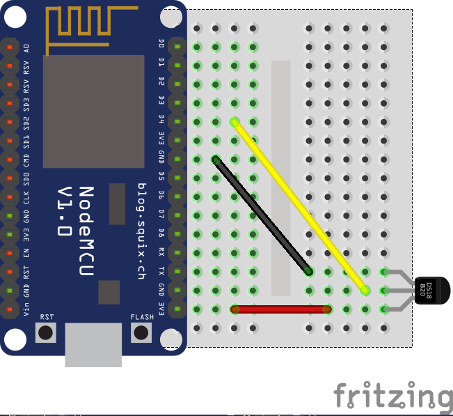

# Prerequisites

To save some time and not waste it by downloading a bunch of data on almost thirty computers, please prepare some software in advance.

## Content of this repository

Please download or clone this repository. It contains files you'll need during the workshop.

## Vagrant (+ VirtualBox)

Vagrant is an awesome tool to manage various virtualization platforms for you and it is able to provision a whole virtual machine just from settings in one file. Vagrantfile for our workshop is available in this repository.

If you are new to Vagrant, you'll also need some virtualization backend. To keep it simple, download and install Virtualbox. If you are using some other like libvirt, keep it.

Virtual machine we'll use for services is based on Fedora 27 and the whole provision script is a part of the Vagrantfile.

Because the first start of the virtual machine takes some time, run the following command in the repository folder in advance (before the workshop). If you encounter any troubles, feel free to ping me during the conference and we can solve it.

```
vagrant up
```

Then you can stop it by:

```
vagrant halt
```

**Download here:**

* Vagrant: https://www.vagrantup.com/downloads.html
* Virtualbox: https://www.virtualbox.org/wiki/Downloads

## Python

We are on Pycon, right? :) I suppose that you have Python already installed, but just to make sure.

We'll need to install one package from PyPI so we need to have Python 3 installed.

* Python: https://www.python.org/downloads/

# Introduction

## Who I am

Lumír Balhar, Python software engineer, member of Python maintenance team in Red Hat, Pyvo meetup org, PyLadies main coach.

## What we'll do today

We are gonna build a simple Python-based home automation system with MQTT communication between a wireless temperature sensor and a Home Assistant.

# Hardware

I'll lend you all the stuff you'll need. If you'd like, you can buy the whole set at the end of the workshop.

## NodeMCU

NodeMCU is a smart board with the ESP8266 WiFi chip which has so much computing power that it can run Python (MicroPython).

## DS18B20 temperature sensor

Very cheap and well-known temperature sensor from Maxim Integrated. It uses the OneWire bus for communication, which allows you to connect multiple sensors to one bus.

## Breadboard, wires, microUSB

We are gonna use a microUSB cable to power the NodeMCU board, and a breadboard + wires to connect the temperature sensor to the NodeMCU.

# Software

## Drivers

If you are on Windows, you'll probably need to install drivers to be able to communicate with the NodeMCU.

Connect the NodeMCU with your computer using a microUSB cable. Be careful! Don't let the silver packaging touch the NodeMCU when it's connected. It can short the pins and destroy the board.

* On Linux, run `dmesg | tail`. You should see that a new device is registered under name ttyUSB0 or similar.
* On Windows, open device manager and check whether the device was recognized or not. If not, install a proper driver from the `drivers` directory. When the device is recognized successfully, remember the COM port name.
* On Mac install driver from drivers directory and restart macOS.

## Picocom/Putty

We need some software to connect to the NodeMCU and to check that everything works. It'll be handy also for checking the status of measuring later.

* On Linux, install package `picocom` which is available in Fedora, Ubuntu and others. If you like other software for serial communication, feel free to use it.
* On Windows, download Putty from [this site](https://www.chiark.greenend.org.uk/~sgtatham/putty/latest.html). You can install Putty system-wide or use standalone executable.
* On Mac, use homebrew to instal picocom `brew install picocom`

## MicroPython

A special port of Python for small IoT devices. It's different than CPython because it contains modules for communication with external devices and doesn't contain some parts of the standard library, help, and so on, to be small enough for IoT devices.

All NodeMCUs already contain the latest MicroPython.

Now is time to connect to the NodeMCU and play with MicroPython.

* On Linux, run `picocom -b 115200 --flow n /dev/ttyUSB0` in a command line. Don't forget to change the name of the device (`ttyUSB0`) to the one returned by the `dmesg | tail` command as instructed above.
    * If you get "no such file or directory error" you probably have a typo in the name of the device. Check it again.
    * If you get a permission error, you'll need to become a member of the `dialout` group. Run `sudo usermod -a -G dialout $(whoami)` and then `su - $(whoami)` to relogin. Output of `groups` command should contain `dialout` in the list of groups now.
* On Windows, run `Putty`, switch `Connection type` to `Serial`, and type your COM port into the `Serial` line. Then switch to `Serial` in the left menu and set `Speed` to `115200` and `Flow control` to `None`. Now click on the `Open` button.
* On Mac, run `picocom -b 115200 --flow n /dev/tty.wchusbserial1410` in the Terminal app, or you can use screen binary in this manner: `screen /dev/tty.wchusbserial1410 115200`

When connected, try to hit Enter or restart the NodeMCU by the RST button near the microUSB connector. You should see `>>>` - the Python prompt!

Let's play with it for a little bit until we solve all connection issues, try to find some differences between the standard CPython implementation and MicroPython.

Homepage: http://micropython.org/

## Ampy

Ampy (Adafruit MicroPython tool) is a handy piece of software which can help us to manage files stored on the NodeMCU and also run Python scripts directly from a computer.

Ampy is available as a package on PyPI so it can be simply installed by `pip install adafruit-ampy`. Feel free to install it system-wide or into virtual environmet if you know how to do it. There is also ampy package available in Fedora packages repositories.

Homepage: https://github.com/adafruit/ampy

## Mosquitto

Mosquitto is a simple MQTT broker service which means that it will stay in the middle between message publishers (sensors) and subscribers (home assistant) and it'll take care of receiving and delivering all of the measured values.

Mosquitto is already installed and ready in the VM. Installation is pretty simple. Take a look into Vagrantfile to know how to do it next time.

Homepage: https://mosquitto.org/

## Home Assistant

Home Assistant is a heart of our home automation platform and we'll spend most of our time configuring it to subscribe to our MQTT topics, show the measured data in a graph and send notifications for configured events.

Home Assistant is also prepared in the virtual machine.

https://www.home-assistant.io/

# Preparing sensor

## Hardware

Before any manipulation, make sure that the NodeMCU is disconnected from a power source (computer)!

To connect the sensor to the NodeMCU use the following schema. Make sure that the orientation of the sensor is right - the text "DS18B20" faces the NodeMCU and the belly of the sensor faces away from the breadboard. Double check the wires before you connect the NodeMCU to a power source.



After connecting the NodeMCU back to a power source, touch the sensor for a while. If it is connected incorrectly, it will become very hot. In that case, disconnect it ASAP and check the wires again.

## Source code

Source code for your first sensor is ready in the `scripts` folder and it is called `DS18B20.py`.

The script has to be modified before we can upload it. Open it in your favorite editor and change the global variables at the top of the file. You have to change at least the IP address of the MQTT broker which should be the IP address of your computer.

To upload this code to the NodeMCU we'll use ampy.

```
ampy -p /dev/ttyUSB0 put scripts/DS18B20.py main.py
```

The first filename is the name of the script on your computer and the second one is the name of the script on the NodeMCU. When the name of the script on the NodeMCU is `main.py` it is executed automatically after every restart. When you are trying to upload, make sure that there are not any other serial connection active.

## Testing

To test that it actually works, we can subscribe to the topic in the MQTT broker. To do that, run this command in the virtual machine. Don't forget to change the topic name.

```
mosquitto_sub -h 127.0.0.1 -d -t temp
```

If it doesn't work, connect to the device directly using picocom or Putty, restart it and see the output in the terminal.

# Configuring HA

HA frontend is already available at http://127.0.0.1:8123

Try it!

## Basic configuration

First, go to the folder `/home/vagrant/.homeassistant/` where all the configuration files are located. Now we make some changes to the default configuration.

* Comment out `introduction` which will remove links from main page.
* Comment out `discovery` which will turn off automatic discovery.
* Comment out `cloud` which will disable cloud integration.

## Weather from the Internet

The `yr` platform provides more than just a weather symbol, so for the start let's configure this sensor to get more data. Place this configuration directly under the `platform: yr` with a proper indentation.

```
monitored_conditions:
    - temperature
    - symbol
    - windSpeed
    - windDirection
    - humidity
    - cloudiness
```

## MQTT broker

Let's set up a connection to the MQTT broker, which allows us to read measured values from the MQTT and show them in HA.

Add these lines somewhere to the configuration file:

```
mqtt:
    broker: 127.0.0.1
    client_id: HA
```

Let's check the configuration and restart the core to load it.

## New sensor

MQTT integration is ready for the first MQTT-based sensor. Let's configure it.

Add these lines somewhere to the file. Don't forget to change the topic name to the one you used with the `mosquitto_sub` command.

```
sensor pycon_temp:
  name: "Pycon temp"
  platform: mqtt
  state_topic: "temp"
  qos: 1
  expire_after: 600
  force_update: true
  unit_of_measurement: "°C"
```

## Better UI

Let's customize the boring UI a little bit.

Groups of devices are also automatically converted to groups in the UI so let's create two groups:

```
group:
  Internet:
    entities:
      - sun.sun
      - sensor.yr_symbol
      - sensor.yr_cloudiness
      - sensor.yr_humidity
      - sensor.yr_temperature
      - sensor.yr_wind_direction
      - sensor.yr_wind_speed
  My sensors:
    entities:
      - sensor.pycon_temp
```

## Graphs

Displaying the measured temperatures is great. Displaying the history of the values is better: Let's create a graph!

```
history_graph:
  pycon_temp:
    name: "PyconCZ temp graph"
    entities:
     - sensor.pycon_temp
     - sensor.yr_temperature
    hours_to_show: 12
    refresh: 60
```

## Notifications

There are a lot of platforms for notifications: https://www.home-assistant.io/components/notify/

We'll try to implement Slack notifications because we have Slack for all Pycon attendees, but you can try whatever you want if you find a suitable plugin for the service you use.

Let's enable the Slack plugin and configure it:

```
notify:
  - name: slack
    platform: slack
    api_key: <API KEY HERE>
    default_channel: '#ha-workshop'
    username: 'Test_user'
```

Now you can test it. In the left pane on HA frontend click on the bottom left icon "Services". In this page, you can test all provided services. Let's choose notify.slack and paste the following JSON to the "Service Data" input field:

```
{"message":"your message"}
```

## Automation

The workshop is called "Home automation", right? Let's create one.

You can create automations in config files and at this time it makes sense to split configuration into multiple files. It's also possible to do it in web interface so let's try it.

Open Configuration > Automation and click on "Plus" symbol in the right bottom corner. You can choose the name of the automation, a trigger which will cause execution of the automation, conditions to evaluate and action to do at the end. You can have multiple triggers, conditions and also multiple actions.

Add a numeric state trigger which will be executed when the temperature measured by your sensor will be higher than 25 degrees. Leave conditions empty and add an action which will call service notify.slack with some general message (in JSON format).

HA supports Jinja templates so you can add sensor state to the message with `{{ states.sensor.pycon_temp.state }}`.

# Conclusion

We hope you liked our workshop. Now you can buy the whole set which contains:

* NodeMCU smart board
* breadboard
* wires
* microUSB cable
* DS18B20 temperature sensor

The price is 150 CZK or €6. It's basically the same price for which you can buy this set on Aliexpress or Ebay. The added value is that you don't have to wait :)

# Next steps

* Take a look at the HA demo: https://www.home-assistant.io/demo/
* You can add as many sensors as you want based on different hardware or create own hardware. Take a look at the list of supported components: https://www.home-assistant.io/components/
* Add more groups and views to make your UI unique and clear.
* You can make some hardware which will listen to the commands from the HA (MQTT).
* You can fully automate your home ... nothing is impossible.
